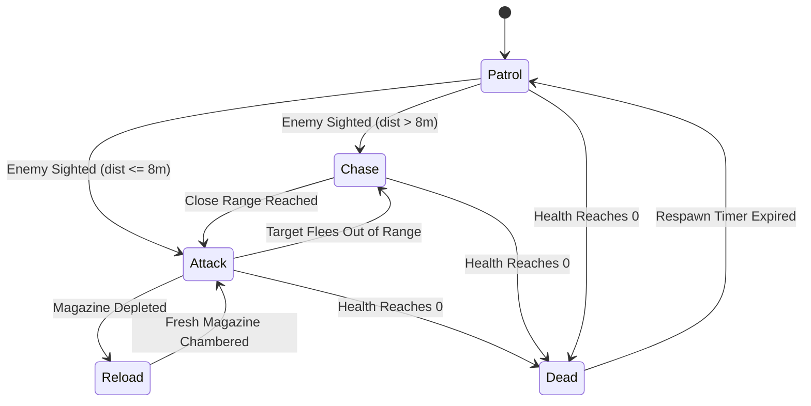

# 🤖 Combat Bot AI & Tactical State Machine

The **Combat Bot AI Subsystem** (`LabAI`) powers intelligent, autonomous opponents in deathmatch (FFA) and team deathmatch (TDM) modes. It features multi-target tactical prioritization, ray-AABB line-of-sight analysis, weapon-specific combat cadence, human-like recoil dynamics, and exact weapon drops upon elimination.

---

## 1. Tactical Finite State Machine (FSM)

Each bot (`CombatBot`) operates under an active state machine:

- **Patrol:** Navigates along waypoints clamped to map geometry with smooth orientation interpolation. Plays `"Walk"` animation.
- **Chase:** Aggressively closes distance toward the target while performing evasive lateral strafing. Plays `"Walk"` animation.
- **Attack:** Maintains tactical combat distance ($3.5\text{ m} - 8.0\text{ m}$). Circles the target, performs stutter-strafing, and fires weapon.
- **Reload:** Retreats or maintains cover while chambering a new magazine. Plays `"Reload"` animation.
- **Dead:** Collapses onto ground with ragdoll impulse kinematics. Spawns exact dropped weapon and resource pickups.

---

## 2. Multi-Target Evaluation & Ray-AABB Line of Sight

Bots continuously scan their surroundings:

1. **Target Selection:** Evaluates distance and visibility against both the local player and other enemy bots (in FFA, all other bots are enemies; in TDM, only opposing team members are targeted).
2. **Line of Sight (LOS):** Casts a Ray from the bot's eye position ($\text{pos} + [0, 1.6, 0]$) to the target's center of mass ($\text{targetPos} + [0, 0.8, 0]$) across all solid map brushes using branchless Kay-Kajiya slab ray-AABB tests. If any solid wall obstructs the ray before reaching the target, LOS is broken.
3. **Anti-Spawncamp Spawn Selection:** Upon death, bots query the map's spawn points using `map.selectBestSpawn()`, which computes Euclidean distance vectors against all active enemies and selects the spawn furthest from hostile clusters.

---

## 3. Weapon Arsenal Distribution & Combat Cadence

Bots are spawned with diverse weapons from the engine's 9-weapon arsenal rather than a uniform loadout:

$$\text{assignedWeapon} = \text{WeaponID}\left((i + 2) \pmod 9\right)$$

Each weapon dictates authentic combat parameters:

| Weapon | Fire Interval | Clip Size | Reload Time | Firing Sound | Tracer Color |
| :--- | :--- | :--- | :--- | :--- | :--- |
| **Lead Pipe** | 0.45 s | 1 | 0.0 s | `PipeSwing` | White (0.01 thk) |
| **Tactical Pistol** | 0.22 s | 12 | 1.8 s | `PistolShot` | Amber Yellow |
| **Combat Shotgun** | 0.75 s | 8 | 2.4 s | `ShotgunShot` | Orange Spark |
| **M4A4-S Tactical** | 0.11 s | 30 | 2.2 s | `M4A4SShot` | Pale Gold |
| **SG553 Rifle** | 0.13 s | 30 | 2.5 s | `SG553Shot` | Bright Orange |
| **Rotary Minigun** | 0.065 s | 100 | 3.5 s | `MinigunShot` | Incandescent Yellow |
| **Plasma Gun** | 0.16 s | 25 | 2.0 s | `PlasmaShot` | Cyan Energy Beam |
| **Kinetic Railgun** | 1.10 s | 5 | 2.8 s | `RailgunShot` | High-Power Electric Blue |
| **RPG Launcher** | 1.40 s | 1 | 2.6 s | `RPGLaunch` | Flame Red Shock |

---

## 4. Human-Like Shooting & Firing Arc

Bots do not shoot like instantaneous rigid turrets:

- **Recoil Arc:** When the trigger is pulled, `shootAnimTimer` is set to $0.28\text{ s}$ ($280\text{ ms}$). This ensures the bot's skeletal armature completes the full recoil kick, muzzle rise, and gradual return-to-aim cycle without premature stuttering.
- **Cadence & Sound:** Gunfire sounds are played via `AudioEngine::playSound3D` using the weapon's specific audio ID, positioned exactly at the bot's weapon muzzle in 3D world space.
- **Magazine Depletion:** Each shot decrements `ammoInClip`. When empty, the bot cannot fire and triggers a tactical reload with `AudioEngine::playSound3D(SoundID::Reload, ...)`.
- **Accuracy & Spread:** Bots feature a baseline accuracy rating ($68\%$ hit chance). Missed shots deflect realistically around the player with randomized cone offsets and impact decals.

---

## 5. Exact Weapon Drop System

When a bot is defeated (either by the player or by an opposing bot in crossfire):

1. The bot collapses with momentum-derived knockback velocity.
2. The game server / AI manager inspects `bot.equippedWeapon`.
3. A `PickupType::WeaponDrop` entity is spawned at the bot's position with `subType = (int)bot.equippedWeapon`.
4. **Visual & Tactical Consistency:** A bot holding a Minigun drops a Minigun pickup; a bot carrying a Railgun drops a Railgun. The player can immediately pick up and wield the exact weapon the bot was firing.
